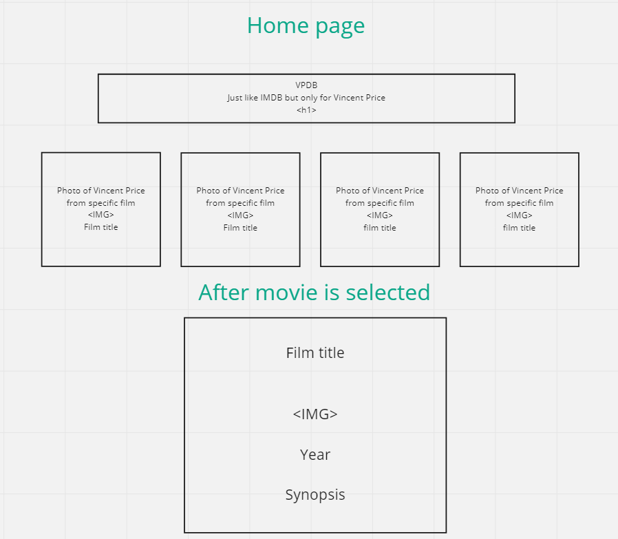

# VPDB (Like IMDB but just for Vincent Price)

## The plan is to create a webpage that catalogs all of Vincent Price's films.

## HTML elements

    - Header: H1 tag "VPDB" H2 tag: "Like IMDB but just for Vincent Price"
    - 

    - script tag with src link to Supabase
    - anchor (a) tag with href "./" to get home

## Events

    -Home page load
        - fetch all the data from Supabase
        - display all the data from Supabase by looping through, render and append to container
    -Details page load
        - fetch just one piece of data from Supabase by unique ID
        - render based on data from Supabase
        - use URLSearchParams to get item ID

## Functions

    - fetch.utils
        - getFilm and getAllFilms
    - render.utils
        - renderCard, renderFilmDetail
